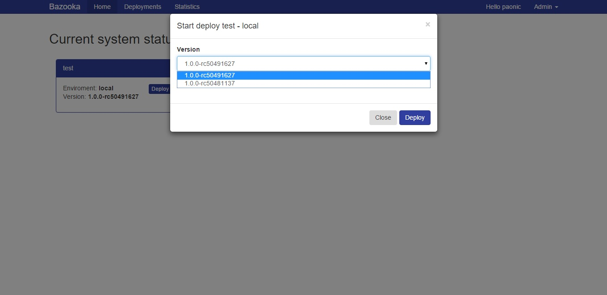

# Your first deploy

To deploy an application you simply have to go on the Bazooka Home page where all the deployments available to you are listed with the version currently deployed.

When there simply click on the **Deploy** button for the Application/Enviroment you have chosen and a dialog similar to this will appear.

Here you can select the version you want to deploy ( and optionally schedule the deploy for a specific moment).

Once you click deploy you can go to the deployments section to see the list of deployments and by clicking onb yours see its logs.

